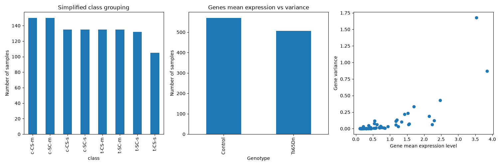
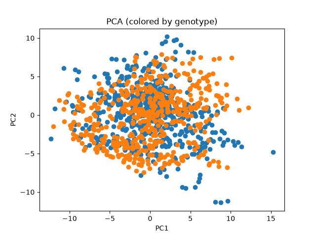

# Practical 1 report: preparing biological data for machine learning

**Student:** Oleh Kovalyshyn
**Date:** 16 Sep 2026
**Practical:** 1 - Data to ML-ready format

## How to use this template

Replace the text in square brackets with your own answers. Include figures and tables where requested. Every result should be accompanied by one or two sentences explaining what it means biologically and what decision it supports.
## 1. Executive summary

In 150-250 words, summarize:

- the biological question
- the dataset or datasets used
- the main preparation decisions
- the most important data-quality issue
- the final train/test design
- one limitation that affects interpretation.

The biological question is to predict the genotype of a mouse (trisomy or control) from gene expression. The dataset comes from Mice Protein Expression (doi: [10.24432/C50S3Z](https://doi.org/10.24432/C50S3Z), CC BY 4.0) by Higuera, Gardiner, Cios (2015).

The data was pre-processed: NA values removed or imputed as described below. For considerable number of observations (100+) information about some important learning/brain development genes was absent and had to be imputed (see below). The final train/test split was generated by randomly splitting the data (75% train, 25% test). The split accounts for biological replicates, so observations of one biological mouse always stay in the same split. Judging from PCA, there's no clear differentiation between genotypes, which can create a challenge for training.

## 2. Data-preparation readiness

Complete this section before describing modelling results.

## Scientific purpose and provenance

- [x] Is the biological question and prediction task stated clearly?
- [x] Is the unit of observation clear (for example, patient, tissue, cell, mouse, or technical measurement)?
- [x] Have I recorded the data version, processing history, and transformations already applied?

## Table shape and identifiers

- [x] Is the table tidy: one observation per row, one variable per column, and one value per cell?
- [x] If the original assay has features in rows and samples in columns, have I transposed it into the format expected by the analysis tool?
- [x] Are row names, column names, and identifiers clear, unique, stable, and free from accidental index columns?
- [x] Can every feature and observation be traced back to its source?
- [x] Are the feature matrix and metadata aligned by an explicit identifier rather than by row order?

## Types, values, and measurement meaning

- [x] Are numerical, categorical, ordinal, text, date, and identifier columns correctly classified?
- [x] Are units, scales, encodings, reference categories, and detection limits understood?
- [x] Have I checked impossible values, inconsistent labels, unexpected categories, constant features, and extreme values?
- [x] Are normalization, scaling, log transformation, and batch-correction steps documented?

## Missing values

- [x] Have I detected missing values using the dataset's actual missing-value representations, not only `NaN`?
- [x] Have I measured missingness by row, column, group, and relevant batch or time variable?
- [x] Do I know whether missingness is structural, technical, or plausibly related to the biology or target?
- [x] Have I justified whether to retain, remove, or impute missing values?
- [x] If imputing, will the imputer be fitted on training data only and then applied to validation/test data?

## Replicates, dependence, and grouping

- [x] Have I checked for exact duplicates and near-duplicate observations?
- [x] Are observations biological replicates, technical replicates, repeated measurements, pseudo-replicates, or independent samples?
- [x] Is the independent biological unit identified by a grouping variable?
- [ ] Will all related observations and their derivatives remain in the same train/validation/test split?
- [x] If I created augmented or synthetic observations, is their provenance recorded and reproducible?

## Target, leakage, and study design

- [ ] Is the target defined before modelling, with its classes or values checked for balance and validity?
- [ ] Have I excluded identifiers, post-outcome variables, duplicated target information, and other leakage sources from the features?
- [ ] Have I identified batch, site, plate, subject, cohort, treatment, sex, age, time, or other possible confounders?
- [ ] Have I checked whether the target is associated with a technical or grouping variable?
- [ ] Does the planned split represent the biological generalization question?

## Reproducibility and decision record

- [ ] Are random seeds, software versions, file names, and input/output shapes recorded?
- [ ] Are all preprocessing steps placed in a reproducible pipeline?
- [ ] Have I recorded unresolved data-quality concerns and the decisions made about them?
- [ ] Can another person explain what each row, column, feature, target, and grouping variable means?

### 3.1 Data presentation

Describe:
- what one row represents
- what one biological mouse represents
- `MouseID` and derived `mouse_id`
- `Genotype`, `Treatment`, `Behavior`, and `class`
- the prediction target selected.

**Answers:**
One row is one experimental sample: a mouse, one of the 5 dilution points, one of the 3 technical replicates

A mouse is a biological sample/replicate. There are 72 unique mice (38 control, 34 trisomic).

`MouseID` is formed by joining a unique mouse identifier with technical replicate identifier. So for each former, there are 15 of the latter. E.g. `309_15` means mouse 309, 15th replicate. `mouse_id` is basically the part before the `_`, just a unique mouse identifier.

`Genotype` is either control or trisomic (Down syndrome).

`Treatment` is either saline or memantine. Saline is used like a control, "untreated" group. Memantine is the drug under investigation.

`Behavior` - context-shock (stimulated to learn) or shock-context (not stimulated). _"The context-shock (CS) group are placed in a novel cage, allowed to explore for several minutes and then given a brief electric shock; normal, wild type mice learn to associate the novel context with the aversive stimulus and will freeze upon re-exposure to the same cage. To control for the effects of the shock alone, a second group of mice, the shock-context (SC) group, are placed in the novel cage, immediately given the electric shock, and then allowed to explore; with these conditions, normal, wild type mice do not learn to associate the novel cage with the shock and do not freeze upon re-exposure to the same cage."_

`class` - a combination of the three previous fields. `c-SC-s` - control mouse, shock-context, saline treatment.

Selected prediction target: Genotype. It's the most obvious choice given the dataset size. An auxillary objective might be how well the model differentiates between Memantine-treated Down mice where the drug helped to rescue learning functions and control mice.

Explain the structure of the dataset

The dataset has genes as columns and observations (technical replicates) as rows. It seems to be bulk data.

### 3.2 Tidy-data assessment and EDA

Report:
- rows and columns: `1080x82`
- unique mice: `72`
- measurements per mouse: `15`
- categories and counts for Genotype, Treatment, Behavior, and class: `Genotype`, `Treatment`, `Behavior`: 2 categories; `class`: `2^3 = 8` categories.
- whether the table is tidy: Yes. Observations are rows and features are columns. For gene counts, the autodetected type of the column is `float64`, so there are no duplicates.

Include at least three plots. For each, state the biological question it addresses.

### 3.3 Diagnostics

Report checks for:
- missingness in proteins and metadata: ✅
- duplicate rows or duplicate measurement identifiers: ✅
- expected 15 measurements per mouse: ✅
- unusual categories or inconsistent labels: ✅
- non-finite, negative, or implausible expression values: ✅
- highly correlated or redundant protein variables: ✅
- predictors that are deterministic parts of the target: ✅.

### 3.4 Preparation and feature roles

Selected supervised-learning question:

Predict genotype based on gene expression levels

Missing-value decision:

There were 3 poor replicates (mouse 3426, samples 13-15). They were filtered out completely. There was also a set of genes with poor detection rate (>100 NAs). Two of them (BAD - 213 NAs and BCL2 - 285 NAs) seem insignificant for the task, but the other three (H3AcK18, EGR1, H3MeK4 with 180, 210 and 270 NAs respectively) are connected to brain development and learning tasks. Therefore, for genes a decision was to impute NAs using median.

### 3.5 Split strategy
- Independent biological unit: `Mouse`
- Grouping variable: `mouse_id`
- Split method: `GroupShuffleSplit`, 2 folds (train, test)

### 3.6 Confounding and distribution structure

Investigate associations between the target and:
- treatment
- behavior
- genotype
- composite class
- number of measurements per mouse.

## References and reproducibility
Together with this report you need to provide
- notebook
- data files
- generated plots